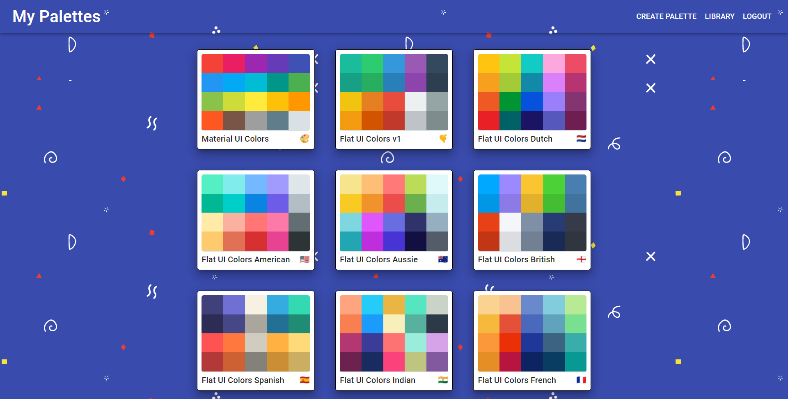
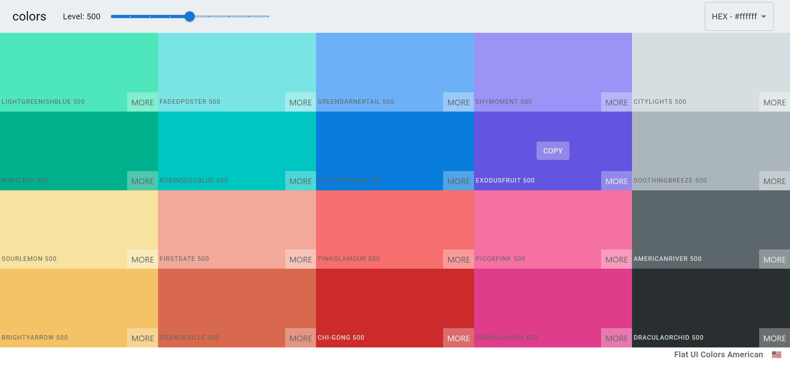
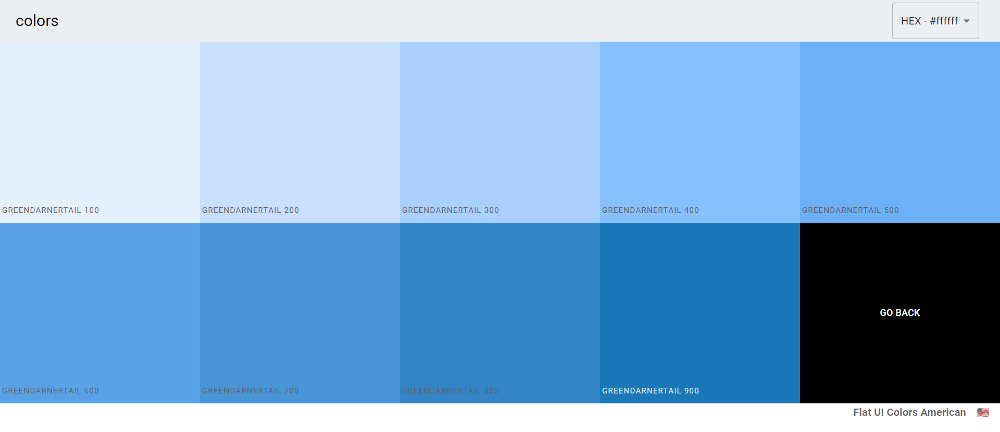
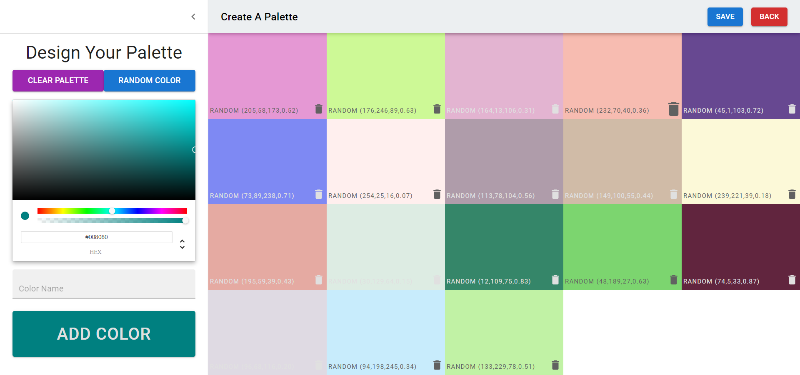

# MyPalettes
Hi!
MyPalettes is a Website for people to design and publish their own color palettes

for live demo [click here](https://my-palettes.web.app/)

sample user:
username - john
password - john147

## Screenshots

## Built With

* [React](https://reactjs.org/)  - React is an open-source, front end, JavaScript library for building user interfaces or UI components.
* [Firebase](https://expressjs.com/) - Firebase is a platform developed by Google for creating mobile and web applications 
* [Material-UI](https://material-ui.com/) - Material-UI is a simple and customizable component library to build faster, beautiful, and more accessible React applications. 
